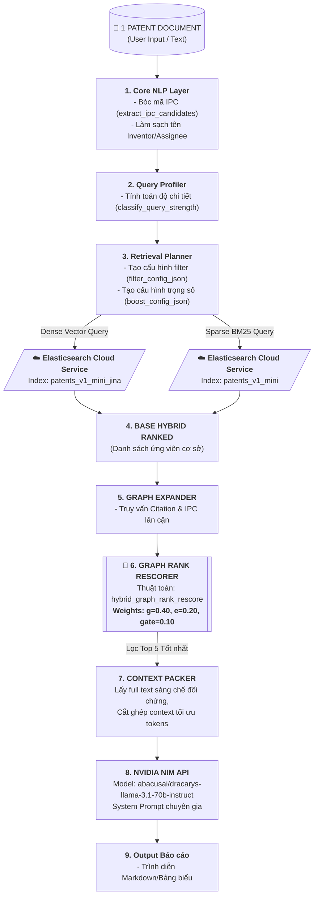

# Kế hoạch Triển khai Toàn diện Pipeline Sản phẩm (Kế hoạch Cuối cùng)

Bản kế hoạch này được thiết kế **nghiêm ngặt theo đúng 5 chỉ thị** của bạn:
1.  ✅ **Luồng End-to-End**: Nhận 1 Tài liệu sáng chế thô -> Sinh Báo cáo phân tích đầy đủ.
2.  ✅ **Lấy Input Tiền xử lý**: Bóc tách thông tin (NLP) và lên kế hoạch Tìm kiếm (Planner) *trước khi* gọi Search.
3.  ✅ **Chiến lược Siêu việt**: Sử dụng duy nhất bộ định lý xếp hạng đỉnh cao **`hybrid_graph_rank_rescore_g040_e020_gate010`** bám sát 100% Notebook.
4.  ✅ **Đơn giản hóa Tối đa**: **LOẠI BỎ HOÀN TOÀN BƯỚC RERANK** để tăng tốc hiệu năng và tiết kiệm tài nguyên.
5.  ✅ **Hạ tầng Cloud**: Kết nối trực tiếp tới cụm Elastic Cloud có sẵn để truy vấn kho CLEF-IP.

---

## 🗺️ Sơ đồ Luồng Dữ liệu Tinh chỉnh (Streamlined Data Flow)

---

## 📂 Cấu trúc Thư mục & Danh mục Module cần Tạo

Chúng ta sẽ xây dựng Pipeline một cách cực kỳ sạch sẽ và mô-đun hóa trong thư mục `backend/app/services/`:

1.  📁 **`app/services/nlp_utils.py`** (Lõi Tiền xử lý):
    *   Bê nguyên hàm `extract_ipc_candidates` (Regex) và `clean_party_name` từ Cell 3/4.
2.  📁 **`app/services/profiler.py`** (Đo đạc & Lên kế hoạch):
    *   Hàm `classify_query_strength` đo độ mạnh yếu của query.
    *   Hàm `build_filter_config` và `build_boost_config` phục vụ bước Planner trước khi Search.
3.  📁 **`app/services/es_client.py`** (Cổng kết nối Dữ liệu):
    *   Khởi tạo `Elasticsearch(cloud_id=..., api_key=...)`.
    *   Hàm `execute_hybrid_search()` thực thi song song BM25 & kNN.
4.  📁 **`app/services/graph_retriever.py`** (Công cụ Đồ thị):
    *   Chuyển dịch class `GraphRetriever` từ Cell 9.
    *   Hàm **`hybrid_graph_rank_rescore_expand_base`** tính toán lại điểm số dựa trên trọng số vàng **0.40 / 0.20 / 0.10**.
5.  📁 **`app/services/analyzer.py`** (Điều phối viên):
    *   Làm nhiệm vụ nhạc trưởng, kết nối các Module 1 -> 4 theo tuần tự, gói context và gửi lên NVIDIA NIM.

---

## 🚀 Kế hoạch Hành động Từng bước (Step-by-Step Execution)

### 📍 BƯỚC 1: Viết Lõi Tiền xử lý & Lập kế hoạch (Modules 1 & 2)
*   Mục tiêu: Viết xong `nlp_utils.py` và `profiler.py`.
*   Đầu vào: Nhận Patent Doc thô -> Đầu ra: Phân tích IPC, Phân loại Weak/Strong, cấu hình Boost Config JSON (đúng cấu hình Notebook).

### 📍 BƯỚC 2: Xây dựng Bộ máy Tìm kiếm Cloud (Module 3)
*   Mục tiêu: Tạo file `es_client.py`.
*   Hiện thực hóa kết nối Cloud ID/API Key, viết hàm lấy Vector Embedding từ model MiniLM và gọi Elasticsearch Cloud để lấy danh sách `base_ranked`.

### 📍 BƯỚC 3: Di trú Thuật toán Đồ thị & Rescorer (Module 4)
*   Mục tiêu: Chuyển dịch logic Rescorer G0.40_E0.20.
*   Xử lý mở rộng đồ thị, kết hợp RRF, áp dụng Rescorer nâng cao để cho ra Top 5 ứng viên có điểm số cao nhất sau khi đã tối ưu bằng thuật toán đồ thị của bạn.

### 📍 BƯỚC 4: Tích hợp NVIDIA NIM & Hoàn thiện Luồng (Module 5)
*   Mục tiêu: Lấy kết quả từ Bước 3 đưa thẳng vào NIM, sinh JSON báo cáo đầy đủ và trả về Frontend UI.

---

💡 **Lời khuyên từ mình**: Kế hoạch này cực kỳ tinh gọn, thực tế và khả thi 100% vì đã loại bỏ được bước Re-ranker nặng nề và không cần dựng local DB. 

**Nếu bạn đã sẵn sàng, chúng ta sẽ tiến hành BƯỚC 1 NGAY LẬP TỨC: Xây dựng Lõi Tiền xử lý NLP bóc mã IPC & Profiler trước khi Search nhé!**
